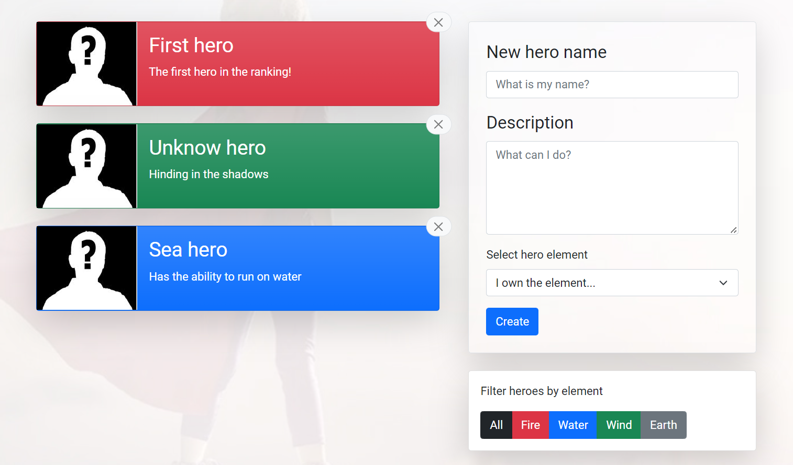

<div align="center">
	<br>
	<h1>Hero Admin Panel</h1>
</div>

<!-- PROJECT SHIELDS -->
<div align="center">

   
   
   
   

</div>

<!-- ABOUT THE PROJECT -->
## About The Project



Hero Admin Panel is a web application for displaying heroes' information.
A user has the ability to create, delete, and filter heroes by their elements.
Hero data is stored on a local JSON server.
In case of any changes by a user, the server reloads itself and the changes are automatically saved to a local JSON
file.

## Built With

* [React](https://reactjs.org/)
* [Redux](https://redux.js.org/)
* [Axios](https://axios-http.com/)
* [Bootstrap](https://getbootstrap.com/)
* [HTML](https://developer.mozilla.org/en-US/docs/Web/HTML)
* [SCSS](https://sass-lang.com/)

<!-- GETTING STARTED -->
## Getting Started

### Prerequisites

* [Git](https://git-scm.com)
* [Node.js](https://nodejs.org/en/download/)
* [npm](http://npmjs.com)

### Installation

```sh
# Step 1: Clone the repository
$ git clone https://github.com/RadyaBen/Hero-Admin-Panel.git

# Step 2: Go into the repository
$ cd Hero-Admin-Panel

# Step 3: Install NPM packages
$ npm install

# Step 4: Run the app
$ npm start
```